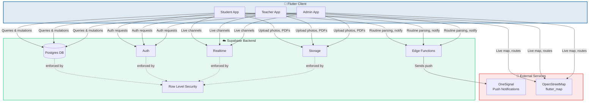
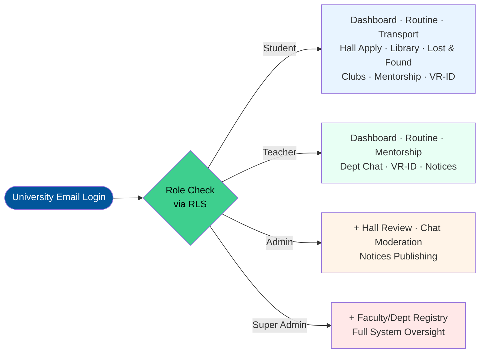
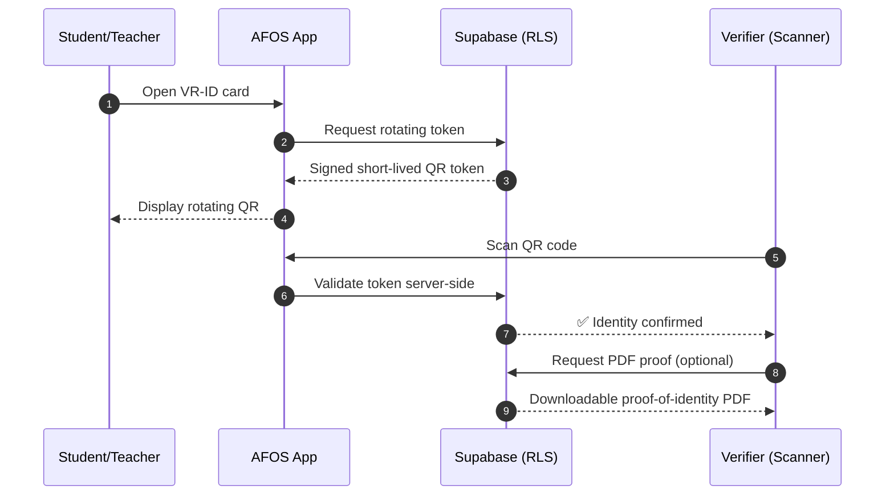
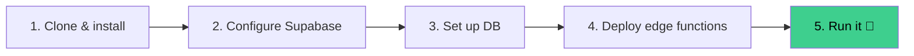
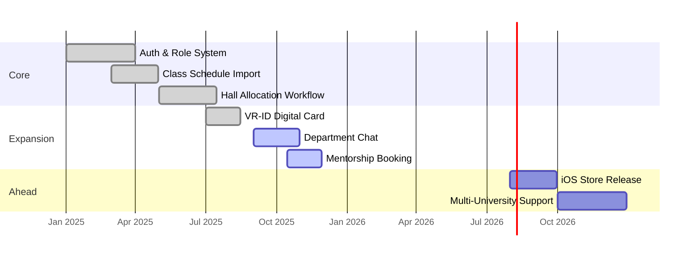

<div align="center">


**Built for Daffodil International University — students, teachers, and administrators, one system.**

[]()
[]()
[]()
[]()
[]()

[]()
[]()
[]()

<p>
  <a href="../../releases/latest"><b>⬇ Download the latest APK</b></a> &nbsp;·&nbsp;
  <a href="../../issues"><b>🐛 Report an issue</b></a> &nbsp;·&nbsp;
  <a href="#-whats-inside"><b>✨ Explore features</b></a> &nbsp;·&nbsp;
  <a href="#%EF%B8%8F-developer-setup"><b>🛠 Dev setup</b></a>
</p>


</div>

---

## 📖 Table of Contents

<div align="center">

| | | |
|:---:|:---:|:---:|
| [🚀 Overview](#-overview) | [⬇ Download](#-download) | [✨ What's Inside](#-whats-inside) |
| [🏗 Architecture](#-architecture) | [🔐 Role-Based Access](#-role-based-access-flow) | [🪪 VR-ID Flow](#-vr-id-verification-flow) |
| [🧰 Tech Stack](#-tech-stack) | [🛠 Developer Setup](#%EF%B8%8F-developer-setup) | [📂 Project Structure](#-project-structure) |
| [🗺 Roadmap](#-roadmap) | [🤝 Contributing](#-contributing) | [📜 License](#-license) |

</div>

---

## 🚀 Overview

**AFOS (All Facilities One System)** is a single, role-aware Flutter application that replaces the scattered mess of Google Forms, notice-board photos, WhatsApp groups, and paper applications every DIU student, teacher, and admin has learned to live with.

One login. One app. Every facility on campus — routines, transport, halls, library, lost & found, clubs, mentorship, department chat, a scannable digital ID, and real-time notifications — wired into a single Supabase-backed system with Postgres Row Level Security enforcing every rule at the database layer, not just in the UI.

> 💡 **This project represents months of dedicated, ground-up engineering** — from reverse-engineering the university's routine PDFs into structured data, to building a verifiable rotating QR digital ID, to designing a full RLS-secured multi-role permission model. It's built to actually be used, not just demoed.

<div align="center">

| 🎯 Goal | 📊 Scope | 🏛 Institution |
|:---:|:---:|:---:|
| Replace fragmented tools with one app | 11+ integrated modules | Daffodil International University |

</div>

---

## ⬇ Download

Grab the latest Android build from the **[Releases](../../releases)** page:

1. Download the `.apk`
2. Open it on your phone
3. Allow **"install from unknown sources"** if prompted
4. No Play Store account needed ✅

> ⚠️ **University-scoped app** — a valid university email is required to register, with a small allowlist of bootstrap accounts reserved for testing.

---

## ✨ What's Inside

AFOS adapts to *who's* using it. A student, a teacher, and an administrator each see a different set of tools — built specifically for their role, not a one-size-fits-all menu.

<table>
<tr><th width="220">Area</th><th>What it does</th></tr>
<tr>
<td>🏠 <b>Dashboard</b></td>
<td>Live notices, quick links, and a role-aware overview the moment you open the app</td>
</tr>
<tr>
<td>📅 <b>Class Schedule</b></td>
<td>Personal timetable filtered to your exact batch/section — imported straight from the university's routine PDF</td>
</tr>
<tr>
<td>🚌 <b>Transport</b></td>
<td>Live bus routes, stop lookup, "find my route" search, and full map view</td>
</tr>
<tr>
<td>🏢 <b>Hall Allocation</b></td>
<td>Apply for a seat, track status, cancel, file complaints — with a complete admin approval workflow behind it</td>
</tr>
<tr>
<td>📚 <b>Library</b></td>
<td>Catalogue browsing, borrowing, and fine tracking</td>
</tr>
<tr>
<td>🔍 <b>Lost & Found</b></td>
<td>Post and claim items with photos; in-app contact reveal only once a claim is accepted</td>
</tr>
<tr>
<td>🎓 <b>Clubs & Events</b></td>
<td>Discover clubs, join, and RSVP to events</td>
</tr>
<tr>
<td>🧑‍🏫 <b>Mentorship</b></td>
<td>Book sessions with faculty mentors, automatically department-matched</td>
</tr>
<tr>
<td>💬 <b>Department Chat</b></td>
<td>Realtime per-department channels, scoped by role (student / faculty / everyone)</td>
</tr>
<tr>
<td>🪪 <b>VR-ID</b></td>
<td>Rotating QR digital ID card with live server-side verification, plus a downloadable PDF proof-of-identity for anyone who scans it</td>
</tr>
<tr>
<td>🔔 <b>Notifications</b></td>
<td>Push + in-app, precisely targeted by role, department, or direct action</td>
</tr>
<tr>
<td>⚙️ <b>Settings</b></td>
<td>Profile, avatar, routine-matching info, theme</td>
</tr>
</table>

### 🛡 For Admins & Super Admins

Dedicated tools layer on top of the student/teacher experience:

- Hall application review & approval
- Cross-department chat moderation
- Notices & rules publishing
- Faculty & department registry management
- Full role-based oversight across every module

---

## 🏗 Architecture



> 🔒 **Every meaningful access rule is enforced server-side via Postgres Row Level Security.** The app's UI hides things for convenience — the database is the real gate.

---

## 🔐 Role-Based Access Flow



---

## 🪪 VR-ID Verification Flow



---

## 🧰 Tech Stack

<div align="center">

| Layer | Technology |
|:---|:---|
| 📱 **App** | Flutter 3 (Android · iOS · Web · Windows/macOS for dev) |
| ☁️ **Backend** | [Supabase](https://supabase.com) — Postgres, Auth, Realtime, Storage, Edge Functions, Row Level Security |
| 🔔 **Push Notifications** | [OneSignal](https://onesignal.com) |
| 🗺 **Maps** | OpenStreetMap via `flutter_map` |

</div>

---

## 🛠️ Developer Setup

### Prerequisites

- [Flutter SDK](https://docs.flutter.dev/get-started/install) 3.x
- A [Supabase](https://supabase.com) project
- [Supabase CLI](https://supabase.com/docs/guides/cli) (for migrations & edge functions)
- A [OneSignal](https://onesignal.com) app (for push notifications)



### 1️⃣ Clone and install dependencies

```bash
git clone https://github.com/rakibhassanrh66/AFOS.git
cd AFOS
flutter pub get
```

### 2️⃣ Configure your Supabase project

Update `lib/config/supabase_config.dart` with your project's URL and publishable key, and `lib/config/app_config.dart` with your OneSignal App ID.

### 3️⃣ Set up the database

```bash
supabase login
supabase link --project-ref <your-project-ref>
supabase db push
```

This applies every migration in `supabase/migrations/` in order.

### 4️⃣ Deploy edge functions

```bash
supabase functions deploy parse-routine
supabase functions deploy send-notification
supabase secrets set SUPABASE_SERVICE_ROLE_KEY=<your_service_role_key>
supabase secrets set ONESIGNAL_REST_KEY=<your_onesignal_rest_key>
```

> 🚫 **Never** put the service-role key or OneSignal REST key in app code — they're server-only secrets, set via `supabase secrets set` and read from the environment inside the edge functions.

### 5️⃣ Run it

```bash
flutter run -d chrome     # Web
flutter run -d android    # Android device/emulator
```

### 📦 Build a release APK

```bash
flutter clean
flutter pub get
flutter build apk --release
```

The APK lands at `build/app/outputs/flutter-apk/app-release.apk`.

---

## 📂 Project Structure

```
lib/
├── config/       # App-wide config, routing, theming
├── core/         # Auth session helpers, shared network/storage utilities
├── features/     # One folder per feature — bloc/presentation/data per module
└── shared/       # Reusable widgets and models

supabase/
├── migrations/   # Every schema/RLS change, applied in order via `supabase db push`
└── functions/    # Edge functions (routine parsing, notifications)
```

---

## 🗺 Roadmap



---

## 🤝 Contributing

Issues and pull requests are welcome! For anything touching the database, please add a **new timestamped migration** under `supabase/migrations/` rather than editing an existing one.

<div align="center">

[](../../issues)
[](../../pulls)

</div>

---

## 📜 License

No license has been set for this project yet — all rights reserved by default until one is added.

---

<div align="center">


**Made with dedication for the DIU community** 💙

</div>
