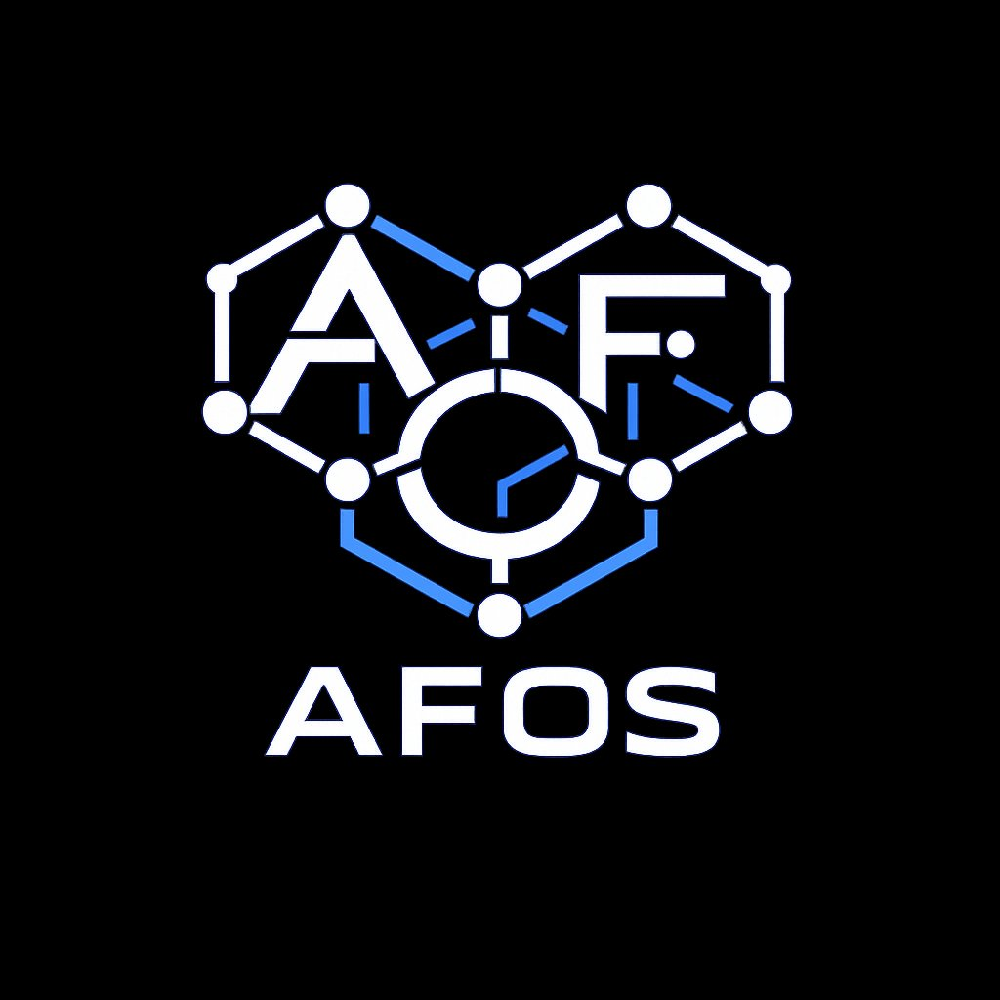
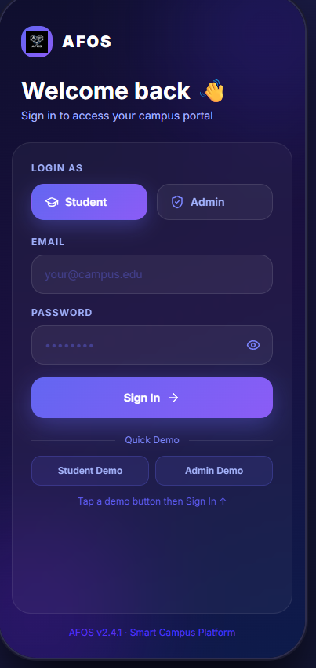
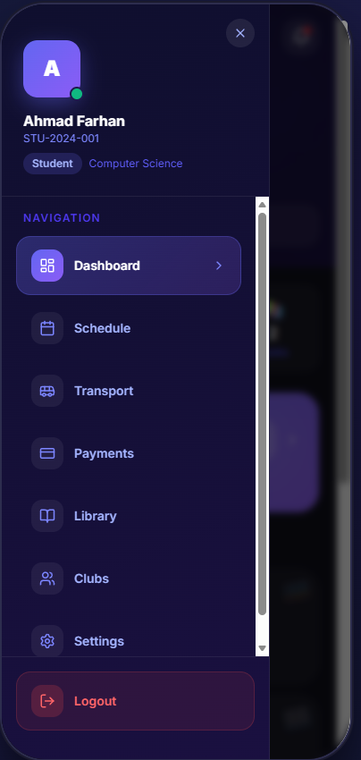
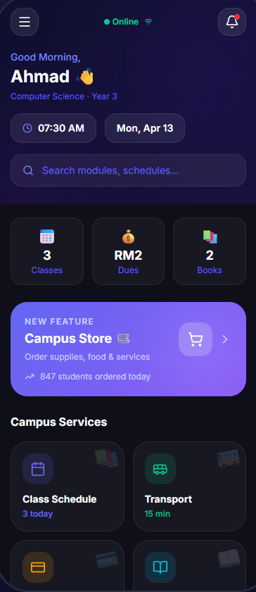
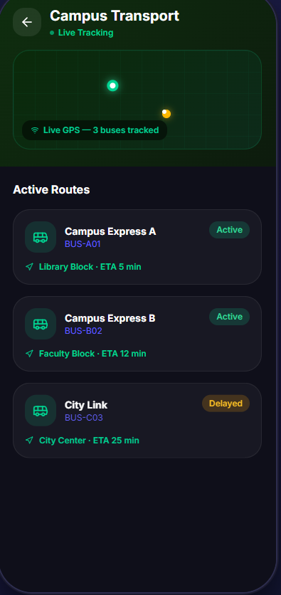

Markdown
<div align="center">

  

  

  ### **Advanced Framework for Operational Systems (AFOS)** *A Next-Generation Digital Solution*

  [](https://vitejs.dev/)
  [](https://www.typescriptlang.org/)
  [](https://github.com/rakibhassanrh66/AFOS)

</div>

---

## 🌌 System Overview

**AFOS** is built for high performance and sleek interaction. This project serves as the final year defense submission, demonstrating advanced state management, responsive sci-fi aesthetics, and seamless user experience. 

> **Mission Objective:** To deploy a highly scalable, futuristic interface that bridges the gap between complex data processing and intuitive human interaction.

---

## 📸 Core Modules (Gallery)

<div align="center">
  <table>
    <tr>
      <td align="center">
        <b>Dashboard View</b><br/>
        
      </td>
      <td align="center">
        <b>Analytics Module</b><br/>
        
      </td>
    </tr>
    <tr>
      <td align="center">
        <b>System Settings</b><br/>
        
      </td>
      <td align="center">
        <b>User Terminal</b><br/>
        
      </td>
    </tr>
  </table>
</div>

---

## 🎥 System Simulation (Project Record)

*Below is the 59-second simulation of the AFOS system in action.*

<div align="center">
  <video src="public/projectrecord.mp4" width="800" controls style="border: 2px solid #00FFCC; border-radius: 10px; box-shadow: 0 0 15px rgba(0, 255, 204, 0.5);">
    Your browser does not support the video tag. <a href="public/projectrecord.mp4">Click here to download the video</a>.
  </video>
</div>

---

## 🧬 Architecture Topology

Here is the operational workflow and architecture of the AFOS system.

```mermaid
graph TD
    classDef sciFi fill:#0a192f,stroke:#00FFCC,stroke-width:2px,color:#00FFCC;
    classDef core fill:#112240,stroke:#64ffda,stroke-width:2px,color:#64ffda;

    User[👤 User Entity]:::sciFi -->|Authentication| UI(🖥️ AFOS Interface):::core
    
    subgraph System Core
        UI -->|API Request| Router[🔀 Router/State]:::sciFi
        Router -->|Fetch Data| DataProcess[⚙️ Data Processing Unit]:::sciFi
        Router -->|Render| DOM[🌐 Virtual DOM]:::sciFi
    end

    DataProcess -->|Queries| DB[(🗄️ Secure Database)]:::core
    DB -->|Payload Return| DataProcess
    DOM -->|Visual Feedback| UI
🚀 Deployment Protocol
To initialize the AFOS local environment:

Clone the Repository:

Bash
git clone [https://github.com/rakibhassanrh66/AFOS.git](https://github.com/rakibhassanrh66/AFOS.git)
Install Dependencies:

Bash
cd AFOS
npm install
Engage Development Server:

Bash
npm run dev
