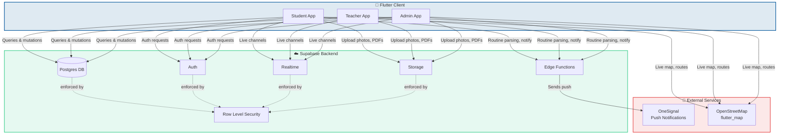
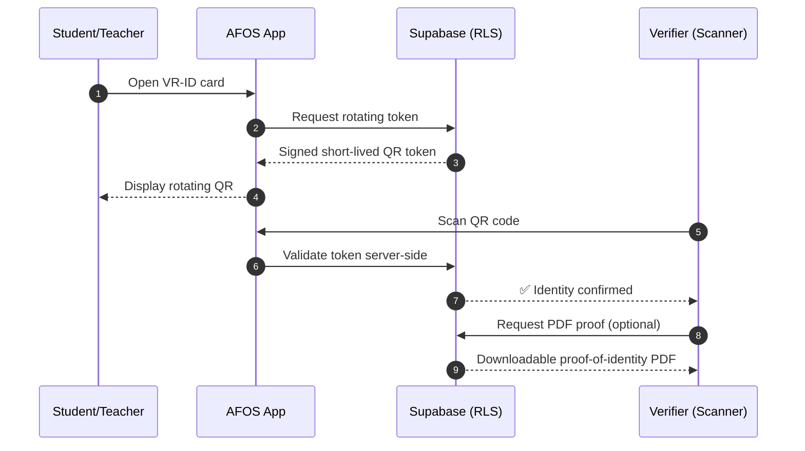
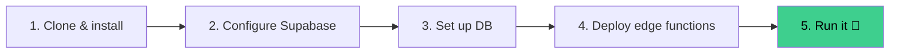
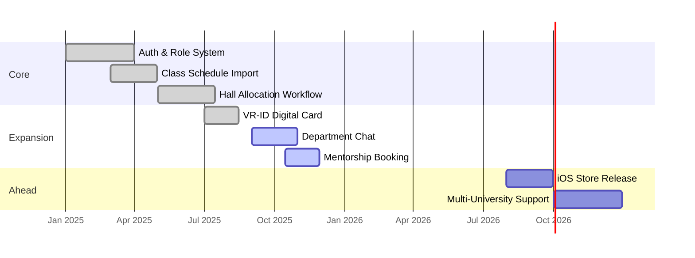

<div align="center">


**Built for Daffodil International University — students, teachers, and administrators, one system.**

[]()
[]()
[]()
[]()
[]()

[]()
[]()
[]()

<p>
  <a href="../../releases/latest"><b>⬇ Download the latest APK</b></a> &nbsp;·&nbsp;
  <a href="../../issues"><b>🐛 Report an issue</b></a> &nbsp;·&nbsp;
  <a href="#-whats-inside"><b>✨ Explore features</b></a> &nbsp;·&nbsp;
  <a href="#%EF%B8%8F-developer-setup"><b>🛠 Dev setup</b></a>
</p>


</div>

---

## 📖 Table of Contents

<div align="center">

| | | |
|:---:|:---:|:---:|
| [🚀 Overview](#-overview) | [⬇ Install](#-install-afos) | [✨ What's Inside](#-whats-inside) |
| [🏗 Architecture](#-architecture) | [🔐 Role-Based Access](#-role-based-access-flow) | [🪪 VR-ID Flow](#-vr-id-verification-flow) |
| [🧰 Tech Stack](#-tech-stack) | [🛠 Developer Setup](#%EF%B8%8F-developer-setup) | [📂 Project Structure](#-project-structure) |
| [🗺 Roadmap](#-roadmap) | [🤝 Contributing](#-contributing) | [📜 License](#-license) |

</div>

---

## 🚀 Overview

**AFOS (All Facilities One System)** is a single, role-aware Flutter application that replaces the scattered mess of Google Forms, notice-board photos, WhatsApp groups, and paper applications every DIU student, teacher, and admin has learned to live with.

One login. One app. Every facility on campus — routines, transport, halls, library, lost & found, clubs, mentorship, department chat, a scannable digital ID, and real-time notifications — wired into a single Supabase-backed system with Postgres Row Level Security enforcing every rule at the database layer, not just in the UI.

> 💡 **This project represents months of dedicated, ground-up engineering** — from reverse-engineering the university's routine PDFs into structured data, to building a verifiable rotating QR digital ID, to designing a full RLS-secured multi-role permission model. It's built to actually be used, not just demoed.

<div align="center">

| 🎯 Goal | 📊 Scope | 🏛 Institution |
|:---:|:---:|:---:|
| Replace fragmented tools with one app | 11+ integrated modules | Daffodil International University |

</div>

---

## ⬇ Install AFOS

<div align="center">

### [**⬇ Download the latest APK**](../../releases/latest)

*No Play Store account. No developer options.*

</div>

**Just grab `AFOS-vX.Y.Z.apk`.** It runs on every Android phone — ARM and x86,
32- and 64-bit — so if you are not sure, that is the one.

If your connection makes a 92 MB download painful, take
**`AFOS-vX.Y.Z-arm64-v8a.apk`** instead: **~34 MB for the identical app**, and it
fits essentially every phone sold in the last seven years. The `armeabi-v7a`
(older 32-bit phones) and `x86_64` (emulators) builds are there for the rest.

| file | size | who it is for |
|---|---:|---|
| `AFOS-vX.Y.Z.apk` | ~92 MB | **anyone** — works everywhere |
| `AFOS-vX.Y.Z-arm64-v8a.apk` | ~34 MB | almost every modern phone |
| `AFOS-vX.Y.Z-armeabi-v7a.apk` | ~31 MB | older 32-bit phones |
| `AFOS-vX.Y.Z-x86_64.apk` | ~37 MB | emulators |

A split installs only on a matching device; picking the wrong one fails
harmlessly and you can install the universal instead. In-app updates always
fetch the universal build, so you never have to think about this again after
the first install.

Every published APK is **signed with the same certificate** and CI refuses to
publish a build whose signature does not match it:

```
SHA-256  2f:49:80:2b:75:33:aa:2f:19:3b:30:de:86:ed:d7:f1
         24:c3:eb:bf:0e:61:96:fb:0c:05:ca:61:4a:03:62:3f
```

That fingerprint is why updates install cleanly over each other — and it is
worth knowing, because Android is going to ask you some alarming questions on
the way in. **All of them are normal for an app installed outside the Play
Store.** Here is exactly what you will see, in order.

### 1 · Your browser warns about the file

Chrome shows *"This type of file can harm your device"* for **every** `.apk`,
regardless of what is inside it. Tap **Download anyway**.

### 2 · Android asks for permission to install

Open the downloaded file. If this is your first sideloaded app, Android says
*"For your security, your phone isn't allowed to install unknown apps from this
source."*

Tap **Settings** → turn on **Allow from this source** → press back. The
permission is granted to the *browser*, once, not to AFOS.

### 3 · Play Protect says the app is unsafe — expected

You will see *"Unsafe app blocked"* or *"App scan recommended"*.

Tap **More details** → **Install anyway**.

Play Protect flags anything it has not seen distributed through the Play Store.
It is a statement about *distribution*, not about the app. If that trade is not
one you want to make, the **[web version](#-web)** needs no install at all.

### 4 · Done

AFOS opens. Sign in with your **university email** — registration requires one.

---

### If something goes wrong

| What you see | What it means | Fix |
|---|---|---|
| **"App not installed"** &nbsp;·&nbsp; **"package conflicts with an existing package"** &nbsp;·&nbsp; **"App not installed as package conflicts"** | All three are the same thing: **a signature mismatch.** A different build of AFOS — a debug copy, a profile build, or one signed with another key — is already on the phone, and Android refuses to replace an app with one signed differently. This is the protection working, not a broken download. | Uninstall the existing AFOS, then install again. *You will be signed out and need to log in once; nothing on the server is lost — results, hall room, courses and everything else come straight back.* Every later update then installs in place. |
| **"There was a problem parsing the package"** | The download was cut short. | Delete the file and download it again on a stable connection. |
| **A permission toggle is greyed out with "Restricted setting"** | Android 13+ withholds some sensitive permissions from sideloaded apps until you unblock them. | Settings → Apps → AFOS → ⋮ (top right) → **Allow restricted settings**. |
| **Play Protect uninstalled it** | Play Protect can remove a sideloaded app it keeps flagging. | Reinstall, and when prompted choose **Don't scan** / **Keep app**. |

---

### 🔄 Updating — the app does it for itself

**You only sideload once.** After that, AFOS checks for new releases on its own
and updates in place:

- A card appears in **Settings** the moment a new version is published.
- Tapping it opens an update sheet that shows the version, what changed, the
  download progress, and a verification step — the app checks the file is a
  complete, real APK before handing it to Android.
- Android's installer confirms, exactly as in step 3 above. Play Protect does
  not re-prompt for an update to an app you already trusted.

**Your account survives an update.** Signing in is not repeated: the session
lives in the Android keystore and is untouched. What *is* cleared is the local
page cache, deliberately — a new version can expect a different shape of cached
data — and it refills from the server the moment you open a screen. Anything you
saved while offline is also kept and syncs as normal.

### 🌐 Web

No install, nothing to allow, always the current version:

AFOS also ships as a web build on Vercel — the current deployment URL is on the
repository's **[Deployments](../../deployments)** page.

On web, press <kbd>Ctrl</kbd>/<kbd>Cmd</kbd>+<kbd>K</kbd> anywhere to jump
straight to any screen you have access to.

> ⚠️ **University-scoped** — registration requires a valid university email, with
> a small allowlist of bootstrap accounts reserved for testing.

---

## ✨ What's Inside

AFOS adapts to *who's* using it. A student, a teacher, and an administrator each see a different set of tools — built specifically for their role, not a one-size-fits-all menu.

<table>
<tr><th width="220">Area</th><th>What it does</th></tr>
<tr>
<td>🏠 <b>Dashboard</b></td>
<td>Live notices, quick links, and a role-aware overview the moment you open the app</td>
</tr>
<tr>
<td>📅 <b>Class Schedule</b></td>
<td>Personal timetable filtered to your exact batch/section — imported straight from the university's routine PDF</td>
</tr>
<tr>
<td>🚌 <b>Transport</b></td>
<td>Live bus routes, stop lookup, "find my route" search, and full map view</td>
</tr>
<tr>
<td>🏢 <b>Hall Allocation</b></td>
<td>Apply for a seat, track status, cancel, file complaints — with a complete admin approval workflow behind it</td>
</tr>
<tr>
<td>📚 <b>Library</b></td>
<td>Catalogue browsing, borrowing, and fine tracking</td>
</tr>
<tr>
<td>🔍 <b>Lost & Found</b></td>
<td>Post and claim items with photos; in-app contact reveal only once a claim is accepted</td>
</tr>
<tr>
<td>🎓 <b>Clubs & Events</b></td>
<td>Discover clubs, join, and RSVP to events</td>
</tr>
<tr>
<td>🧑‍🏫 <b>Mentorship</b></td>
<td>Book sessions with faculty mentors, automatically department-matched</td>
</tr>
<tr>
<td>💬 <b>Department Chat</b></td>
<td>Realtime per-department channels, scoped by role (student / faculty / everyone)</td>
</tr>
<tr>
<td>🪪 <b>VR-ID</b></td>
<td>Rotating QR digital ID card with live server-side verification, plus a downloadable PDF proof-of-identity for anyone who scans it</td>
</tr>
<tr>
<td>🔔 <b>Notifications</b></td>
<td>Push + in-app, precisely targeted by role, department, or direct action</td>
</tr>
<tr>
<td>⚙️ <b>Settings</b></td>
<td>Profile, avatar, routine-matching info, theme</td>
</tr>
</table>

### 🛡 For Admins & Super Admins

Dedicated tools layer on top of the student/teacher experience:

- Hall application review & approval
- Cross-department chat moderation
- Notices & rules publishing
- Faculty & department registry management
- Full role-based oversight across every module

---

## 🏗 Architecture


```mermaid
flowchart TB
    subgraph Client["📱 Flutter Client"]
        A1[Student App]
        A2[Teacher App]
        A3[Admin App]
    end

    subgraph Backend["☁️ Supabase Backend"]
        B1[(Postgres DB)]
        B2[Auth]
        B3[Realtime]
        B4[Storage]
        B5[Edge Functions]
        B6[Row Level Security]
    end

    subgraph External["🔌 External Services"]
        C1[OneSignal<br/>Push Notifications]
        C2[OpenStreetMap<br/>flutter_map]
    end

    A1 & A2 & A3 -->|Auth requests| B2
    A1 & A2 & A3 -->|Queries & mutations| B1
    A1 & A2 & A3 -->|Live channels| B3
    A1 & A2 & A3 -->|Upload photos, PDFs| B4
    A1 & A2 & A3 -->|Routine parsing, notify| B5

    B5 -->|Sends push| C1
    A1 & A2 & A3 -->|Live map, routes| C2

    B1 -.enforced by.-> B6
    B2 -.enforced by.-> B6
    B3 -.enforced by.-> B6
    B4 -.enforced by.-> B6

    style Backend fill:#3ECF8E20,stroke:#3ECF8E,stroke-width:2px
    style Client fill:#02569B20,stroke:#02569B,stroke-width:2px
    style External fill:#E54A4A20,stroke:#E54A4A,stroke-width:2px
```

> 🔒 **Every meaningful access rule is enforced server-side via Postgres Row Level Security.** The app's UI hides things for convenience — the database is the real gate.

---

## 🔐 Role-Based Access Flow


```mermaid
flowchart LR
    Login([University Email Login]) --> Check{Role Check<br/>via RLS}

    Check -->|Student| S[Dashboard · Routine · Transport<br/>Hall Apply · Library · Lost & Found<br/>Clubs · Mentorship · VR-ID]
    Check -->|Teacher| T[Dashboard · Routine · Mentorship<br/>Dept Chat · VR-ID · Notices]
    Check -->|Admin| Ad[+ Hall Review · Chat Moderation<br/>Notices Publishing]
    Check -->|Super Admin| SA[+ Faculty/Dept Registry<br/>Full System Oversight]

    style Login fill:#02569B,color:#fff
    style Check fill:#3ECF8E,color:#000
    style S fill:#e8f4ff
    style T fill:#e8fff4
    style Ad fill:#fff4e8
    style SA fill:#ffe8e8
```

---

## 🪪 VR-ID Verification Flow


```mermaid
sequenceDiagram
    autonumber
    participant U as Student/Teacher
    participant App as AFOS App
    participant DB as Supabase (RLS)
    participant V as Verifier (Scanner)

    U->>App: Open VR-ID card
    App->>DB: Request rotating token
    DB-->>App: Signed short-lived QR token
    App-->>U: Display rotating QR
    V->>App: Scan QR code
    App->>DB: Validate token server-side
    DB-->>V: ✅ Identity confirmed
    V->>DB: Request PDF proof (optional)
    DB-->>V: Downloadable proof-of-identity PDF
```

---

## 🧰 Tech Stack

<div align="center">

| Layer | Technology |
|:---|:---|
| 📱 **App** | Flutter 3 (Android · iOS · Web · Windows/macOS for dev) |
| ☁️ **Backend** | [Supabase](https://supabase.com) — Postgres, Auth, Realtime, Storage, Edge Functions, Row Level Security |
| 🔔 **Push Notifications** | [OneSignal](https://onesignal.com) |
| 🗺 **Maps** | OpenStreetMap via `flutter_map` |

</div>

---

## 🛠️ Developer Setup

### Prerequisites

- [Flutter SDK](https://docs.flutter.dev/get-started/install) 3.x
- A [Supabase](https://supabase.com) project
- [Supabase CLI](https://supabase.com/docs/guides/cli) (for migrations & edge functions)
- A [OneSignal](https://onesignal.com) app (for push notifications)


```mermaid
flowchart LR
    A[1. Clone & install] --> B[2. Configure Supabase] --> C[3. Set up DB] --> D[4. Deploy edge functions] --> E[5. Run it 🚀]
    style E fill:#3ECF8E,color:#000
```

### 1️⃣ Clone and install dependencies

```bash
git clone https://github.com/rakibhassanrh66/AFOS.git
cd AFOS
flutter pub get
```

### 2️⃣ Configure your Supabase project

Update `lib/config/supabase_config.dart` with your project's URL and publishable key, and `lib/config/app_config.dart` with your OneSignal App ID.

### 3️⃣ Set up the database

```bash
supabase login
supabase link --project-ref <your-project-ref>
supabase db push
```

This applies every migration in `supabase/migrations/` in order.

### 4️⃣ Deploy edge functions

```bash
supabase functions deploy parse-routine
supabase functions deploy send-notification
supabase secrets set SUPABASE_SERVICE_ROLE_KEY=<your_service_role_key>
supabase secrets set ONESIGNAL_REST_KEY=<your_onesignal_rest_key>
```

> 🚫 **Never** put the service-role key or OneSignal REST key in app code — they're server-only secrets, set via `supabase secrets set` and read from the environment inside the edge functions.

### 5️⃣ Run it

```bash
flutter run -d chrome     # Web
flutter run -d android    # Android device/emulator
```

### 📦 Build a release APK

```bash
flutter clean
flutter pub get
flutter build apk --release
```

The APK lands at `build/app/outputs/flutter-apk/app-release.apk`.

---

## 📂 Project Structure

```
lib/
├── config/       # App-wide config, routing, theming
├── core/         # Auth session helpers, shared network/storage utilities
├── features/     # One folder per feature — bloc/presentation/data per module
└── shared/       # Reusable widgets and models

supabase/
├── migrations/   # Every schema/RLS change, applied in order via `supabase db push`
└── functions/    # Edge functions (routine parsing, notifications)
```

---

## 🗺 Roadmap


```mermaid
gantt
    dateFormat  YYYY-MM-DD
    axisFormat  %b %Y
    section Core
    Auth & Role System        :done, 2025-01-01, 90d
    Class Schedule Import     :done, 2025-03-01, 60d
    Hall Allocation Workflow  :done, 2025-05-01, 75d
    section Expansion
    VR-ID Digital Card        :done, 2025-07-01, 45d
    Department Chat           :active, 2025-09-01, 60d
    Mentorship Booking        :active, 2025-10-15, 45d
    section Ahead
    iOS Store Release         :2026-08-01, 60d
    Multi-University Support  :2026-10-01, 90d
```

---

## 🤝 Contributing

Issues and pull requests are welcome! For anything touching the database, please add a **new timestamped migration** under `supabase/migrations/` rather than editing an existing one.

<div align="center">

[](../../issues)
[](../../pulls)

</div>

---

## 📜 License

No license has been set for this project yet — all rights reserved by default until one is added.

---

<div align="center">


**Made with dedication for the DIU community** 💙

</div>
