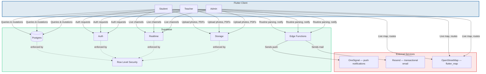
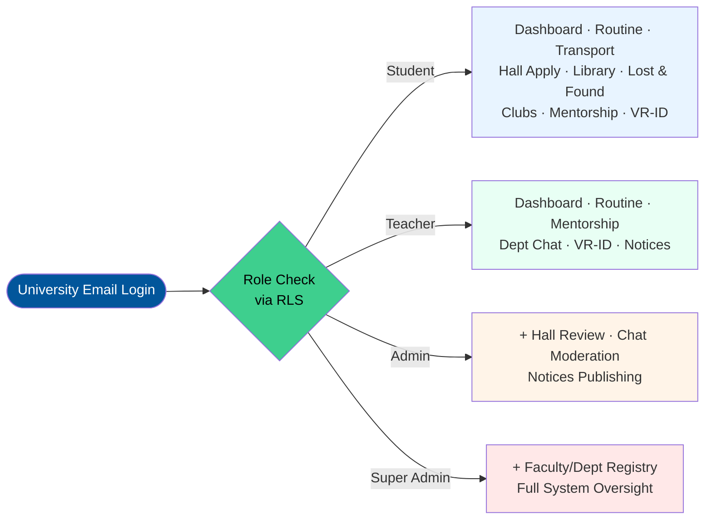

<div align="center">

# AFOS — All Facilities One System

A role-aware campus platform for Daffodil International University, built with Flutter and Supabase.

[](../../actions)
[]()
[]()
[]()
[]()

[Download the latest APK](../../releases/latest) · [Report an issue](../../issues) · [Feature list](#whats-inside) · [Developer setup](#developer-setup)

</div>

---

## Table of Contents

| | | |
|:---|:---|:---|
| [Overview](#overview) | [Install AFOS](#install-afos) | [What's Inside](#whats-inside) |
| [Architecture](#architecture) | [Role-Based Access](#role-based-access) | [VR-ID Verification](#vr-id-verification) |
| [Tech Stack](#tech-stack) | [Developer Setup](#developer-setup) | [Project Structure](#project-structure) |
| [Project Status](#project-status) | [Contributing](#contributing) | [License](#license) |

---

## Overview

**AFOS (All Facilities One System)** replaces the scattered tools a DIU student, teacher, or admin normally has to juggle — Google Forms, notice-board photos, WhatsApp groups, and paper applications — with a single role-aware application.

One login surfaces a different set of tools depending on who's signed in: a student, a teacher, and an administrator each get a screen set built for their role rather than a shared menu with things hidden by permission. Every access rule is enforced at the database layer with Postgres Row Level Security — the client UI hides what a role can't use, but the database is the actual gate, so a request that bypasses the app entirely is still denied.

Two pieces of the system are worth calling out specifically:

- **Routine and exam-seat ingestion** — the university publishes class routines and exam seating as PDFs with no public API. AFOS parses those PDFs (Syncfusion's PDF engine, table-region detection) into structured, queryable schedule and seat-plan data, joined against course offerings and batch/section assignment.
- **VR-ID** — a rotating, server-signed QR digital ID. The QR token is short-lived and re-issued by the backend, so a screenshot of it goes stale; verification happens against the database, not the client.

The codebase currently sits at **224 Dart files / ~58,000 lines** across **70 screens**, backed by **212 Postgres migrations** and **12 edge functions**.

---

## Install AFOS

<div align="center">

### [Download the latest APK](../../releases/latest)

*No Play Store account. No developer options.*

</div>

**Just grab `AFOS-vX.Y.Z.apk`.** It runs on every Android phone — ARM and x86,
32- and 64-bit — so if you are not sure, that is the one.

If your connection makes a 92 MB download painful, take
**`AFOS-vX.Y.Z-arm64-v8a.apk`** instead: **~34 MB for the identical app**, and it
fits essentially every phone sold in the last seven years. The `armeabi-v7a`
(older 32-bit phones) and `x86_64` (emulators) builds are there for the rest.

| File | Size | Who it's for |
|---|---:|---|
| `AFOS-vX.Y.Z.apk` | ~92 MB | Anyone — works everywhere |
| `AFOS-vX.Y.Z-arm64-v8a.apk` | ~34 MB | Almost every modern phone |
| `AFOS-vX.Y.Z-armeabi-v7a.apk` | ~31 MB | Older 32-bit phones |
| `AFOS-vX.Y.Z-x86_64.apk` | ~37 MB | Emulators |

A split installs only on a matching device; picking the wrong one fails
harmlessly and you can install the universal build instead. In-app updates
always fetch the universal build, so this only matters for the first install.

Every published APK is **signed with the same certificate**, and CI refuses to
publish a build whose signature doesn't match it:

```
SHA-256  2f:49:80:2b:75:33:aa:2f:19:3b:30:de:86:ed:d7:f1
         24:c3:eb:bf:0e:61:96:fb:0c:05:ca:61:4a:03:62:3f
```

That fingerprint is why updates install cleanly over each other — and it's
worth knowing, because Android asks some alarming-looking questions on the way
in. **All of them are normal for an app installed outside the Play Store.**
Here is exactly what you'll see, in order.

### 1. Your browser warns about the file

Chrome shows *"This type of file can harm your device"* for **every** `.apk`,
regardless of what's inside it. Tap **Download anyway**.

### 2. Android asks for permission to install

Open the downloaded file. If this is your first sideloaded app, Android says
*"For your security, your phone isn't allowed to install unknown apps from this
source."*

Tap **Settings** → turn on **Allow from this source** → press back. The
permission is granted to the *browser*, once — not to AFOS.

### 3. Play Protect says the app is unsafe — expected

You'll see *"Unsafe app blocked"* or *"App scan recommended."*

Tap **More details** → **Install anyway**.

Play Protect flags anything it hasn't seen distributed through the Play Store.
That's a statement about *distribution*, not about the app. If that trade
isn't one you want to make, the **[web version](#web)** needs no install at
all.

### 4. Done

AFOS opens. Sign in with your **university email** — registration requires one.

---

### If something goes wrong

| What you see | What it means | Fix |
|---|---|---|
| **"App not installed"** · **"package conflicts with an existing package"** · **"App not installed as package conflicts"** | All three are the same thing: **a signature mismatch.** A different build of AFOS — a debug copy, a profile build, or one signed with another key — is already on the phone, and Android refuses to replace an app with one signed differently. This is the protection working, not a broken download. | Uninstall the existing AFOS, then install again. *You'll be signed out and need to log in once; nothing on the server is lost — results, hall room, courses and everything else come straight back.* Every later update then installs in place. |
| **"There was a problem parsing the package"** | The download was cut short. | Delete the file and download it again on a stable connection. |
| **A permission toggle is greyed out with "Restricted setting"** | Android 13+ withholds some sensitive permissions from sideloaded apps until you unblock them. | Settings → Apps → AFOS → ⋮ (top right) → **Allow restricted settings**. |
| **Play Protect uninstalled it** | Play Protect can remove a sideloaded app it keeps flagging. | Reinstall, and when prompted choose **Don't scan** / **Keep app**. |

---

### Updating — the app does it for itself

**You only sideload once.** After that, AFOS checks for new releases on its own
and updates in place:

- A card appears in **Settings** the moment a new version is published.
- Tapping it opens an update sheet that shows the version, what changed, the
  download progress, and a verification step — the app checks the file is a
  complete, real APK before handing it to Android.
- Android's installer confirms, exactly as in step 3 above. Play Protect does
  not re-prompt for an update to an app you already trusted.

**Your account survives an update.** Signing in isn't repeated: the session
lives in the Android keystore and is untouched. What *is* cleared is the local
page cache, deliberately — a new version can expect a different shape of cached
data — and it refills from the server the moment you open a screen. Anything you
saved while offline is kept and syncs as normal.

### Web

No install, nothing to allow, always the current version:

AFOS also ships as a web build on Vercel — the current deployment URL is on the
repository's **[Deployments](../../deployments)** page.

On web, press <kbd>Ctrl</kbd>/<kbd>Cmd</kbd>+<kbd>K</kbd> anywhere to jump
straight to any screen you have access to.

> **University-scoped.** Registration requires a valid university email, with
> a small allowlist of bootstrap accounts reserved for testing.

---

## What's Inside

AFOS adapts to *who's* using it — a student, a teacher, and an administrator each see a different set of tools built for their role, not a one-size-fits-all menu.

### Academic

| Module | What it does |
|---|---|
| **Dashboard** | Role-aware home screen — live notices, quick links, at-a-glance status |
| **Class Schedule** | Personal timetable parsed from the university's routine PDFs, plus course-offering management, module-leader teaching load, join requests, and room-availability lookup |
| **Attendance** | Session marking for faculty; personal attendance history for students |
| **Grades** | DIU mark-component breakdown with CGPA/SGPA computation |
| **Assignments** | Creation, submission, and grading |
| **Exam Seat Plan** | Seat allocation parsed from exam-routine PDFs, cross-referenced against the class routine and batch/section |

### Campus Life

| Module | What it does |
|---|---|
| **Transport** | Live bus routes, stop lookup, route search, and a full map view |
| **Hall Allocation** | Apply for a seat, track status, cancel, file complaints — with a complete admin approval workflow behind it |
| **Library** | Catalogue browsing, borrowing, and fine tracking |
| **Lost & Found** | Post and claim items with photos; contact details are revealed only once a claim is accepted |
| **Clubs & Events** | Discover clubs, join, and RSVP to events |
| **Conference Room Booking** | Reserve a room with live availability checks |
| **Mentorship** | Book sessions with faculty mentors, automatically department-matched |
| **Student Portal** | Ledger, scholarship, waiver, career resources, transport card, notices, and facilities overview in one hub |
| **Payment** | In-app view of campus dues, with an embedded payment flow for settling them |

### Identity, Safety & Communication

| Module | What it does |
|---|---|
| **VR-ID** | Rotating QR digital ID with live server-side verification, plus a downloadable PDF proof of identity |
| **SOS** | Emergency alert broadcast to nearby users by location, with an admin-side incident dashboard |
| **Department Chat** | Realtime channels scoped by department and role |
| **Notices** | Published announcements, role-targeted |
| **Notifications** | Push and in-app, targeted by role, department, or direct action |
| **Global Search** | Cross-module search from anywhere in the app |
| **Feedback** | Submission and admin triage |
| **Settings** | Profile, avatar, routine-matching info, theme |

### Admin & Super Admin

Dedicated tools layer on top of the student/teacher experience:

- Hall application review and approval
- Course-offering and faculty-allocation management
- Cross-department chat moderation
- SOS incident oversight
- Notices publishing
- Faculty and department registry
- Routine and exam-routine PDF upload pipeline
- User management and activity log
- Feedback triage

---

## Architecture


```mermaid
flowchart TB
    subgraph Client["Flutter Client"]
        A1[Student]
        A2[Teacher]
        A3[Admin]
    end

    subgraph Backend["Supabase"]
        B1[(Postgres)]
        B2[Auth]
        B3[Realtime]
        B4[Storage]
        B5[Edge Functions]
        B6[Row Level Security]
    end

    subgraph External["External Services"]
        C1[OneSignal — push notifications]
        C2[Resend — transactional email]
        C3[OpenStreetMap — flutter_map]
    end

    A1 & A2 & A3 -->|Auth requests| B2
    A1 & A2 & A3 -->|Queries & mutations| B1
    A1 & A2 & A3 -->|Live channels| B3
    A1 & A2 & A3 -->|Upload photos, PDFs| B4
    A1 & A2 & A3 -->|Routine parsing, notify| B5

    B5 -->|Sends push| C1
    B5 -->|Sends mail| C2
    A1 & A2 & A3 -->|Live map, routes| C3

    B1 -.enforced by.-> B6
    B2 -.enforced by.-> B6
    B3 -.enforced by.-> B6
    B4 -.enforced by.-> B6

    style Backend fill:#3ECF8E20,stroke:#3ECF8E,stroke-width:2px
    style Client fill:#02569B20,stroke:#02569B,stroke-width:2px
    style External fill:#E54A4A20,stroke:#E54A4A,stroke-width:2px
```

> **Every meaningful access rule is enforced server-side via Postgres Row Level Security.** The app's UI hides things for convenience — the database is the real gate.

---

## Role-Based Access


```mermaid
flowchart LR
    Login([University Email Login]) --> Check{Role Check<br/>via RLS}

    Check -->|Student| S[Dashboard · Routine · Transport<br/>Hall Apply · Library · Lost & Found<br/>Clubs · Mentorship · VR-ID]
    Check -->|Teacher| T[Dashboard · Routine · Mentorship<br/>Dept Chat · VR-ID · Notices]
    Check -->|Admin| Ad[+ Hall Review · Chat Moderation<br/>Notices Publishing]
    Check -->|Super Admin| SA[+ Faculty/Dept Registry<br/>Full System Oversight]

    style Login fill:#02569B,color:#fff
    style Check fill:#3ECF8E,color:#000
    style S fill:#e8f4ff
    style T fill:#e8fff4
    style Ad fill:#fff4e8
    style SA fill:#ffe8e8
```

---

## VR-ID Verification


```mermaid
sequenceDiagram
    autonumber
    participant U as Student/Teacher
    participant App as AFOS App
    participant DB as Supabase (RLS)
    participant V as Verifier (Scanner)

    U->>App: Open VR-ID card
    App->>DB: Request rotating token
    DB-->>App: Signed short-lived QR token
    App-->>U: Display rotating QR
    V->>App: Scan QR code
    App->>DB: Validate token server-side
    DB-->>V: Identity confirmed
    V->>DB: Request PDF proof (optional)
    DB-->>V: Downloadable proof-of-identity PDF
```

---

## Tech Stack

| Layer | Technology |
|---|---|
| **App** | Flutter 3.41.6 (Dart) — Android, Web |
| **State Management** | flutter_bloc |
| **Routing** | go_router |
| **Backend** | [Supabase](https://supabase.com) — Postgres, Auth, Realtime, Storage, Edge Functions, Row Level Security |
| **Push Notifications** | [OneSignal](https://onesignal.com) |
| **Transactional Email** | [Resend](https://resend.com) |
| **Maps** | OpenStreetMap via `flutter_map` |
| **PDF Parsing** | Syncfusion PDF — routine and exam-routine ingestion |
| **Local Storage** | Hive, `flutter_secure_storage` |
| **Biometrics** | `local_auth` |
| **QR** | `mobile_scanner`, `qr_flutter` |
| **CI/CD** | GitHub Actions — static analysis, database security audits, signed release builds |

---

## Developer Setup

### Prerequisites

- [Flutter SDK](https://docs.flutter.dev/get-started/install) 3.41.6
- A [Supabase](https://supabase.com) project
- [Supabase CLI](https://supabase.com/docs/guides/cli) (for migrations and edge functions)
- A [OneSignal](https://onesignal.com) app (for push notifications)

### 1. Clone and install dependencies

```bash
git clone https://github.com/rakibhassanrh66/AFOS.git
cd AFOS
flutter pub get
```

### 2. Configure your Supabase project

Update `lib/config/supabase_config.dart` with your project's URL and publishable key, and `lib/config/app_config.dart` with your OneSignal App ID.

### 3. Set up the database

```bash
supabase login
supabase link --project-ref <your-project-ref>
supabase db push
```

This applies every migration in `supabase/migrations/` in order.

### 4. Deploy edge functions

```bash
supabase functions deploy parse-routine
supabase functions deploy send-notification
supabase secrets set SUPABASE_SERVICE_ROLE_KEY=<your_service_role_key>
supabase secrets set ONESIGNAL_REST_KEY=<your_onesignal_rest_key>
```

> **Never** put the service-role key or OneSignal REST key in app code — they're server-only secrets, set via `supabase secrets set` and read from the environment inside the edge functions.

### 5. Run it

```bash
flutter run -d chrome     # Web
flutter run -d android    # Android device/emulator
```

### Build a release APK

```bash
flutter clean
flutter pub get
flutter build apk --release
```

The APK lands at `build/app/outputs/flutter-apk/app-release.apk`.

---

## Project Structure

```
lib/
├── config/       # App-wide config, routing, theming
├── core/         # Auth session helpers, shared network/storage utilities
├── features/     # One folder per feature — bloc/presentation/data per module
└── shared/       # Reusable widgets and models

supabase/
├── migrations/   # Every schema/RLS change, applied in order via `supabase db push`
└── functions/    # Edge functions — routine parsing, registration/approval,
                   # push and email dispatch, SOS alerts, release announcements
```

---

## Project Status

AFOS is under active, near-daily development. The full version history and
per-release notes live on the **[Releases](../../releases)** page.

**Platform support is intentionally scoped to Android and Web.** iOS and
desktop (Windows/macOS/Linux) are not shipped: several dependencies this app
relies on (`mobile_scanner`, `webview_flutter`, `local_auth`, `geolocator`)
either lack desktop support or need per-platform verification this project
doesn't have the hardware/tooling to do properly. Rather than claim support
that hasn't been built or tested, those platforms stay out of scope until
that changes.

---

## Contributing

Issues and pull requests are welcome. This is primarily a solo-maintained
project, so response time varies — but bug reports and concrete suggestions
are read. For anything touching the database, add a **new migration** under
`supabase/migrations/` rather than editing an existing one.

[](../../issues)
[](../../pulls)

---

## License

No license has been set for this project yet — all rights reserved by default until one is added.

---

<div align="center">

Built for the Daffodil International University community.

</div>
